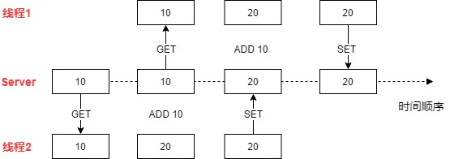
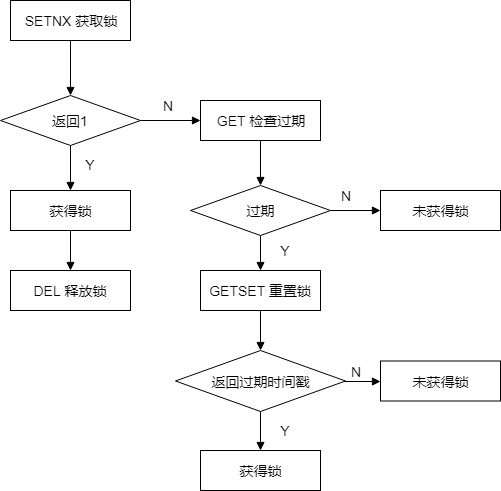

# Redis并发请求问题

**在并发请求的情况下，如何处理Redis写竞争的问题？**

比如秒杀活动修改剩余奖品数量，转账修改账户余额、流量控制（同一用户1秒钟只能请求一次）等等。对于修改数值的场景，Redis提供了一系列原子计数器命令，类似MySQL的`update val = val + 10`对值直接更新。而对于复杂数据的修改，只能先读出，修改后再写入。于是就有了写竞争问题。





如图，两个线程分别进行加10的操作，在非原子的情况下，出现了竟态条件，正确情况下应该是30。


## 解决方案

Redis是单线程模型，在Server端采用队列模式串行地、原子地执行，没有锁和同步机制。因此需要自己在业务端实现。

### 方案一 ：[INCR命令](https://redis.io/commands/incr)

`INCR ` 是Redis的原子计数器，语法是`INCR key` ，当key不存在时，将key设为0并返回；当key存在时，对key加一并返回。类似地，还有`INCRBY` 用于增加指定的值，`HINCRBY`、`ZINCRBY` 用于哈希表和有序集合。

**所有并发修改数值的场景，都可以使用这些命令来解决。**

#### Example 1：秒杀

假设秒杀抽奖活动共有10个名额，先来的用户先得到。可以使用`INCR`，当返回值小于10的时候，即为中奖。另一种思路是把奖项存储在队列（Lists）中，使用`LPOP`命令从队列中取出，当返回值为nil时，说明奖品已经发完了。

#### Example 2： 流量控制

假设要限制每个IP地址一秒钟最多请求10次，可以将 `ip地址 + unix时间戳 ` 作为键。每次请求到来时，先GET键值，如果大于10次则拒绝请求，否则执行请求，并`INCR`这个键，再设置一个过期时间以保证键能被自动清理。

另一种更加优雅的方案是：只将`ip地址`作为键，首次请求成功时，设置1秒的过期时间，下一秒就会重新开始计数。

#### Example 3： 每个用户只能请求一次

假设要求每个用户只能请求一次，那就需要将用户ID存储起来。哈希表和`HINCRBY`是个不错的选择。哈希表的键为用户ID，值表示用户的请求次数。当用户发起请求时，使用`HINCRBY `将用户ID对应的键值加一，如果返回值等于1，说明是首次请求。返回大于1表示已经请求过了。


### 方案二：[SETNX、GETSET命令加锁](https://redis.io/commands/setnx)

`SETNX` 的意思是set if not exists，语法`SET key value` ，当key不存在时设置值，否则不做任何操作。设置成功，返回1，设置失败，返回0。

比如要对关键字foo的资源进行操作，首先要获得foo的锁。客户端可以尝试：

```
SETNX lock.foo <current Unix time + lock timeout + 1>
```

如果SETNX返回1，说明客户端获得了锁，设置的unix时间是锁的失效时间，之后客户端可以通过`DEL lock.foo` 来释放锁。

如果SETNX返回0，说明锁已经被其他客户端占用了。如果锁是非阻塞的，我们可以返回调用，或者进入一个重试循环，直到获得锁或超时。

**处理死锁**

如果因为客户端失败、崩溃，或者其他原因不能释放锁怎么办？

这种情况可以检测——因为key保存的是unix时间戳，如果保存的时间戳小于当前时间戳，表示锁已经失效。

但是，当有多个客户端同时检测一个锁是否过期并尝试释放它的时候，我们不能简单地删除key，然后再用 `SETNX` 上锁，因为这时候存在竞态条件。

* C1和C2读取lock.foo并检查时间戳，SETNX都返回0，因为它已经被C3锁上了，但C3在上锁之后崩溃了。
* 如果此时C1、C2因为时间戳过期，分别执行 `DEL lock.foo` ，那么它们将同时获得锁，从而产生竟态条件。

幸好，以下算法可以避免这个问题，我们看看C4客户端：

* C4发送 `SETNX lock.foo` 命令，因为C3占有琐，所以Redis向C4返回0
* C4发送 `GET lock.foo` 检查锁是否过期，如果未过期，则休眠一段时间后重试
* 如果锁已过期（lock.foo存储的时间戳小于当前时间戳），C4执行：

```
GETSET lock.foo <current Unix timestamp + lock timeout + 1>
```

[GETSET](https://redis.io/commands/getset)命令`GETSET key value`，将值设为value，并返回旧值。

* 因为`GETSET`的作用，C4可以检查key存储的旧值是否还是一个过期的时间戳，如果是，那么C4获得锁。
* 假设另一个客户端C5，比C4更快地执行了`GETSET`并获得了锁，那么C4的`GETSET`返回一个未过期的时间戳，C4只好从第一步开始重试。
* 注意，即使C4对key进行了修改，这对未来也没有什么影响。

为了让这个加锁算法更健壮，获得锁的客户端应该总是在执行`DEL`之前检查过期时间，避免意外释放锁。因为客户端失败的情况非常复杂，不仅仅是崩溃这么简单，还有可能是因为某些操作阻塞了很长时间，紧接着执行`DEL`(锁已经被其他客户端持有)。


用流程图总结一下：



## 扩展

用Redlock算法实现分布式锁 (TODO)

### 


